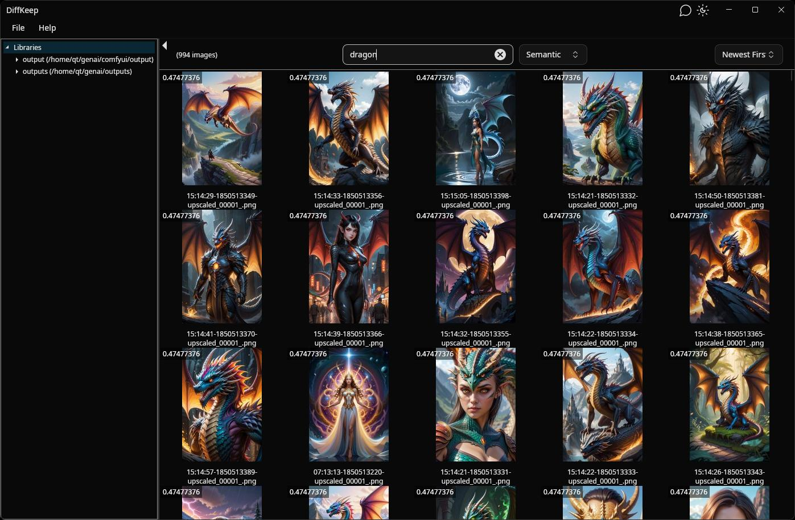

# DiffKeep

_AI Generated Art Manager_

Manage your AI-generated images with ease. Sort, filter, search, delete, and organize. https://diffkeep.com

Join our Discord to discuss DiffKeep or ask questions: https://discord.gg/hGCQJArtZY

### Current Status

My time is currently being absorbed by real life, and I don't have as much to spare for DiffKeep as I would like.
I plan to get back to working on DiffKeep more regularly, but I don't know yet when that will be.

DiffKeep is stable and works with basic functionality as outlined in the checkboxes below. I use it regularly for my own images.

There are [builds available](https://github.com/DiffKeep/DiffKeep/releases), but they have not been tested extensively.
I don't have a Mac, so I have no idea if the MacOS version works at all, but the Linux and Windows builds should work.
If you run into any problems, please create an issue and let me know.



### Beta Status

***DiffKeep is completely free while in beta.***

Note: DiffKeep is currently in a Beta state. Some features may be incomplete or missing, and there may be bugs or crashes.
No guarantee is made of suitability or stability. Please note the relevant part of the license in LICENSE.md.

Once DiffKeep is considered stable and feature-complete enough to exit beta status, it will transition to a freemium model,
where the essential features will be free, such as full-text search, but advanced features such as semantic and hybrid search will
require a license.

## Feature Roadmap

*Roughly in order of priority.* 

- [x] Display images by folder or date
- [x] Add multiple libraries
- [x] Multi-select and delete images
- [x] View raw and parsed generation metadata [limited to positive prompt only for now]
- [x] Full-text search inside prompts
- [x] Vector search image prompts. Prompt detection support for:
    - [x] Comfyui
    - [x] Automatic1111 (Needs more testing with newer versions)
    - [ ] Fooocus
    - [ ] CivitAI
    - _More to come_
- [ ] Project view to see all images related to a named project
- [ ] Tags and favorites
- [ ] Hybrid semantic and full text search (WIP)
- [ ] AI-generated image descriptions (also exposed in vector search)
- [ ] Image similarity search (search by image)
- [ ] File drag and drop out support (DnD source), cross-platform
    - [ ] Windows
    - [ ] Mac
    - [ ] Linux
        - [ ] X11
        - [ ] Wayland
- [ ] File drag and drop in support (DnD target), cross-platform
    - [ ] Image parsing in the viewer
    - [ ] Search by image
- [ ] Generation integration with image generation tools:
    - [ ] ComfyUI
    - [ ] Internal image generation?
- [ ] LiveGrid - Generate grids live in any dimension, save generated images with grid data, export any 2 dimensions to a "grid" image
- [ ] Use of "Processes" to generate and modify images in steps without leaving DiffKeep
- [ ] Integration with CivitAI if possible (see [CivitAI](https://github.com/civitai/civitai))
    - Currently (according to their wiki), this integration may be very limited in scope. Eventually I would like to enable posting images directly from DiffKeep.

## Development Notes

You need to have LibVips installed for your platform:
https://github.com/kleisauke/net-vips#install

Create a file `DiffKeep/Settings/Secrets.cs` and fill it out like this:

```csharp
namespace DiffKeep.Settings;

public static class Secrets
{
    public const string FeedbackApiKey = "api-key-here";
}
```

This is the API key used to send feedback.

## Fair Use Notice

This software includes a registration system to unlock advanced features. We kindly ask that you do not modify or bypass this system to gain unauthorized access to paid functionality.

While the Prosperity License allows noncommercial modification, tampering with the registration mechanism to avoid payment violates the spirit of the license and may be considered misuse.

If you’re interested in contributing or need access for educational or nonprofit purposes, please reach out—we’re happy to work with you.

## Legal Notice

This project is maintained by the DiffKeep GitHub organization, but all rights are owned by **Fifth Interactive LLC**. For licensing or commercial inquiries, please contact [hello@diffkeep.com](mailto:hello@diffkeep.com).